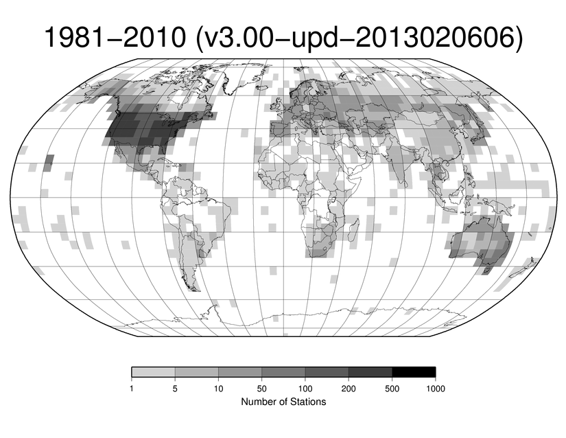
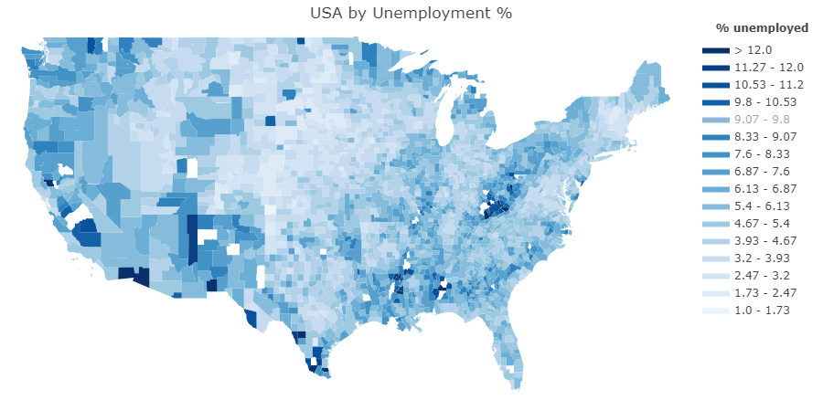
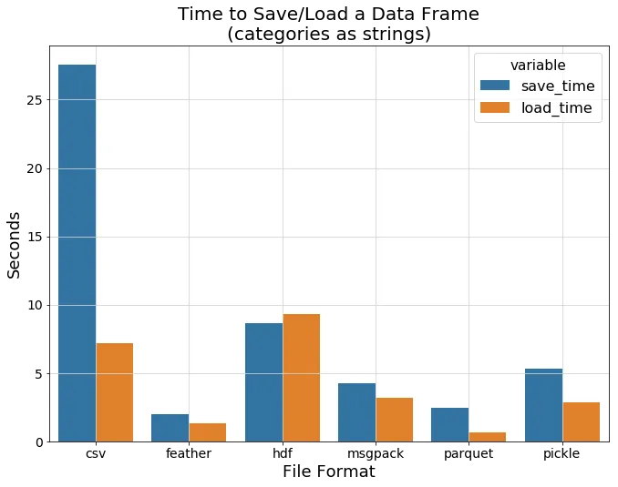
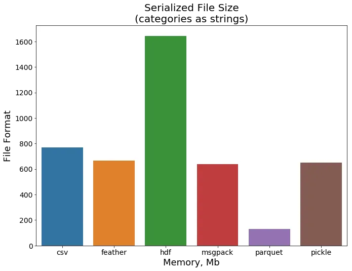

# Resources for DU project 1

## Project Team
 - Jeff Flachman
 - Tomas Brown
 - Pedro Zurita

## Weather Data

- [NOAA daily weather data](https://www1.ncdc.noaa.gov/pub/data/ghcn/daily/by_year/) ~ 158 MB/year
- [GHCND file info](https://docs.opendata.aws/noaa-ghcn-pds/readme.html) with station ID decoder ring
- [GHCND stations](https://www1.ncdc.noaa.gov/pub/data/ghcn/daily/ghcnd-stations.txt)
    - includes [stationID, lat, lon, elev, state, station name, GSN, HCN/CRN, WMO ID]
- [GNCDN station inventory](https://www1.ncdc.noaa.gov/pub/data/ghcn/daily/ghcnd-inventory.txt)
- Available NOAA Ground station locations worldwide
    

## Housing Data

- [Housing Characteristics at Proximity one](https://proximityone.com/zip18dp4.htm)
- [Housing data - US Census](https://www.census.gov/library/video/2023/adrm/downloading-exporting-and-sharing-2020-census-demographic-and-housing-characteristics-data.html)
    - Need to check license.
- median Home prices:
    - [US Census data](https://data.census.gov/table/ACSDT5Y2022.B25077?t=Financial%20Characteristics:Housing%20Value%20and%20Purchase%20Price&g=010XX00US$8600000&y=2022) 
        - datasets: B2503, B2506, B2507 & DP04 can provide the needed data.  We will not need all these sources.
    - [nar.realtor pdf report](https://www.nar.realtor/research-and-statistics/housing-statistics/county-median-home-prices-and-monthly-mortgage-payment)
    - [Federal Housing Finance Agency](https://www.fhfa.gov/DataTools/Downloads/Pages/House-Price-Index-Datasets.aspx#qat)
    - [additonal fhfa files](https://www.fhfa.gov/DataTools/Downloads/Pages/UAD-Appraisal-Level-Public-Use-File.aspx)

## County and Zip Code info

### FIPS GEOID Codes

Breakdown of 2 to 15 digit FIPS codes.
- [FIPS GEOID Codes](https://www.geocod.io/guides/census/)

OpenData Delaware has zipcode/county geojsons defined.
- [State-zip-code-GeoJSON](https://github.com/OpenDataDE/State-zip-code-GeoJSON)


### Counties

get county info from lat / lon

- [fcc / census](https://geo.fcc.gov/api/census/#!/block/get_block_find)
    - [FCC API terms of service](https://www.fcc.gov/reports-research/developers/api-terms-service)
    - example
    ```
    https://geo.fcc.gov/api/census/block/find?latitude=39.6667&longitude=-104.0284&censusYear=2020&showall=true&format=json


### Zipcodes:

**Problem**:  Convert lat/lon to return zipcode.  For this a reverse geocoder is required.

**Issue**: Most online resources cost about 200-500 to convert 80K lat,lons to zip, city etc.

#### <u>Google Maps</u>
**Issue**:  Google maps API can solve the problem.  However, the data cannot be used outside of google maps.
- [Convert lat lon to zip code](https://gis.stackexchange.com/questions/352961/converting-lat-lon-to-postal-code-using-python)
    - Google Maps [license](https://developers.google.com/maps/terms-20180207)
    ```
    $x = file_get_contents("http://maps.google.com/maps/geo?ll=10.345561,123.896932");
    $j_decodex = json_decode($x);
    print_r($j_decodex);
    ```

#### <u>Openstreetmaps</u>

Openstreetmaps is a opensource foundation for openGIS data.  They provide a reverse geocoder called Nominatim.
**Issue**: Openstreetmaps nominatim API has a limited usage licesnce of 1/sec and not large conversions

- [openstreetmap DB](https://planet.openstreetmap.org/)
    - [openstreemap copyright](https://www.openstreetmap.org/copyright)
    - [open streetmap for US](http://download.geofabrik.de/north-america.html)
    - [nominatim](https://nominatim.org/release-docs/latest/admin/Installation/)
        - [nominatim docker](https://github.com/mediagis/nominatim-docker)
        - [nominatim github](https://github.com/osm-search/Nominatim)


#### Others

- [Reverse Geocode](https://pypi.org/project/reverse-geocode/)
- [ArcGIS zip codes](https://www.arcgis.com/home/item.html?id=8d2012a2016e484dafaac0451f9aea24)
- [All country postal codes](https://download.geonames.org/export/zip/)

#### Simplemaps 

Simplemaps provides a list of Zipcodes and Counties with a centroid lan/lon.  This is an inacurrate method to map ground stations to zips or counties

- [counties](https://simplemaps.com/data/us-counties)
- [zipcodes](https://simplemaps.com/data/us-zips)


## Visualization

### Google Maps

- [How To Import Shapefile Into Google Maps || Embed Google Maps In Your Website || The GIS Hub](https://www.youtube.com/watch?v=tfmVe2bY724)
- [Add a KML files to google maps](https://support.google.com/maps/thread/237045555/how-to-add-a-polygon-shapefile?hl=en)

### Plotly: Looks pretty simple

- [plotly choropleth map](https://plotly.com/python/choropleth-maps/)
- [County Example](https://plotly.com/python/county-choropleth/#simple-example)
-   May need to determine plotly code for each county and merge into dataframes in Step 2 above
- Zip Codes
    - [Medium Articles on zip code plots](https://medium.com/@mm.fuenteslopez/using-plotly-express-to-make-zip-code-level-choropleth-maps-a8ac8212b7ed)
    - [Zip Code Geojson files](https://github.com/OpenDataDE/State-zip-code-GeoJSON)
        - will need to determine how to provide value for each zipcode.

### Example map in plotly:



### County / Zipcode shape files

- County KML Shapefiles: [US Census Cartographic Boundary Files (2022)](https://www.census.gov/geographies/mapping-files/time-series/geo/cartographic-boundary.2022.html)
- Zipcode KML Shapefiles: [US Census Cartographic Boundary Files (2020)](https://www.census.gov/geographies/mapping-files/time-series/geo/cartographic-boundary.2020.html)
- Manipulate KML files: [fastKML](https://fastkml.readthedocs.io/en/latest/)


## Storing Large files

[Toward Data Science Article](https://towardsdatascience.com/the-best-format-to-save-pandas-data-414dca023e0d)

 



## Data Reshaping
- [Medium article on advanced reshaping](https://baotramduong.medium.com/python-for-data-science-pivot-vs-52dd3879078f) with pivot, melt, stack, pivot_table, wide_to_long, crosstab, & concat
